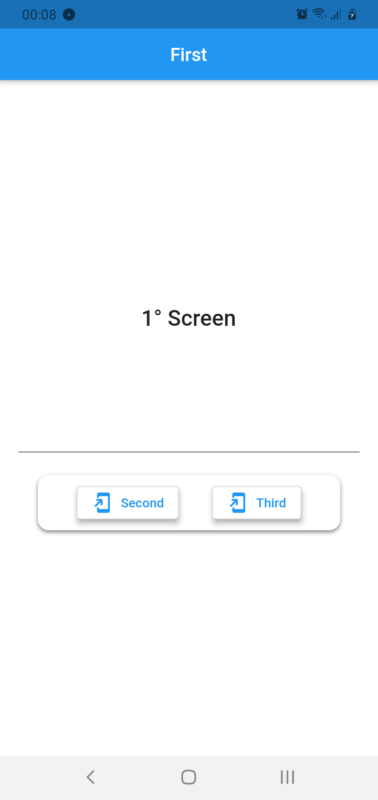
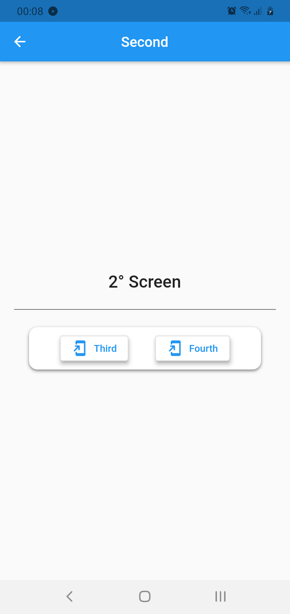
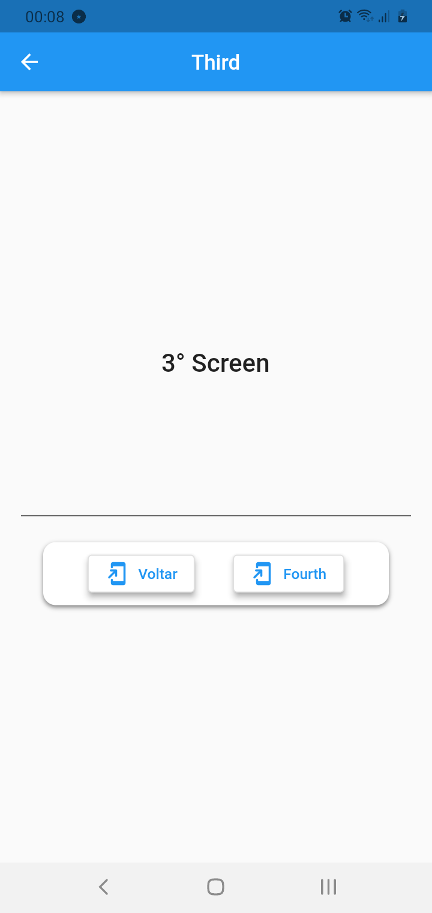
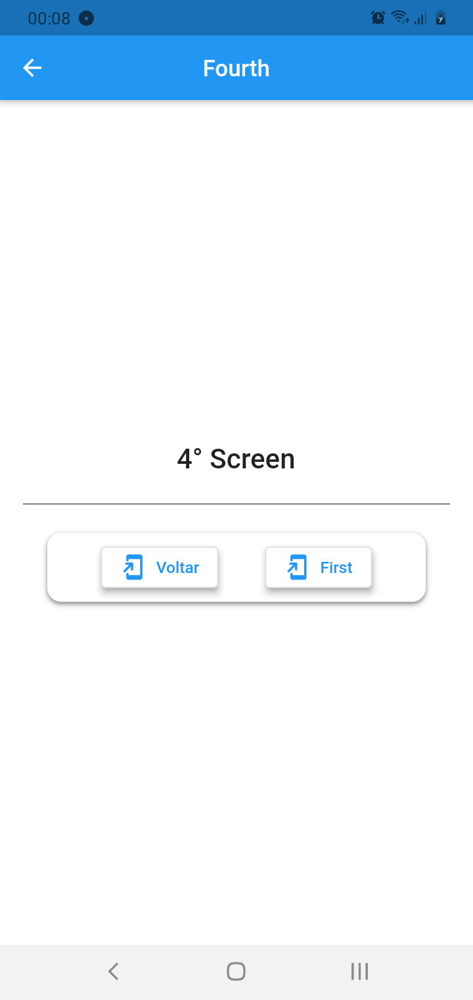

# Flutter | Módulo 02 - Aula 14 - Navegação 

## Exercícios de casa 🏠

# ====== **Navegando** ======

Você deve criar um app com 4 telas, com as seguintes características:

### O Design vai ser um trabalho crativo, então podem fazer da forma mais bonita que conseguirem.

### Primeira Tela (Home):

- Deve possuir 2 botões: 

    - Um para a tela 'Dois'
    - Uma para a tela 'Três'

### Segunda Tela:

- Deve possuir 2 botões:
    - Um para a tela 'Três'
    - Uma para a tela 'Quatro'

### Terceira Tela:

- Deve possuir 2 botões:
    - Um para voltar
    - Um para ir para a tela 'Quatro', removendo a tela 3 (popAndPushnamed)

- Deve receber como parâmetro a Cor de Fundo da Tela:
    - Caso não receba a cor, ela deve ficar preta

### Quarta Tela:

- Deve possuir 2 botões:
    - Um para voltar para a Home
    - Um para voltar 

- Deve receber um objeto como parâmetro com Nome e Idade
    - O valores do objeto devem ser exibidos na tela
    - Caso não seja passado o parâmetro, o app não pode quebrar

## **Telas criada:**

[//]: # (Adicione seus gifs / imagens aqui:)

 
   

   
  
  
  
  

## **Linguagens e Ferramentas:**
[//]: # (Adicione os recursos do seu projeto aqui:)

- <code></code> **Flutter**
- <code></code> **Dart**

# **Conferir checklist**
Preencha a checklist para finalizar o exercício:

- [x] Criar um projeto n GitHub
- [x] Clonar o projeto. No terminal, na pasta que desejar, execute `git clone #URL_DO_PROJETO` 
- [x] Adicionar as mudanças aos commits (`git add .` para adicionar todos os arquivos ou `git add nome_do_arquivo` para adicionar um arquivo específico)
- [x] Commitar a cada mudança significativa ou na finalização do exercício (`git commit -m "Mensagem do commit"`)
- [x] Pushar os commits na sua branch na origem (`git push origin nome-da-branch`)
